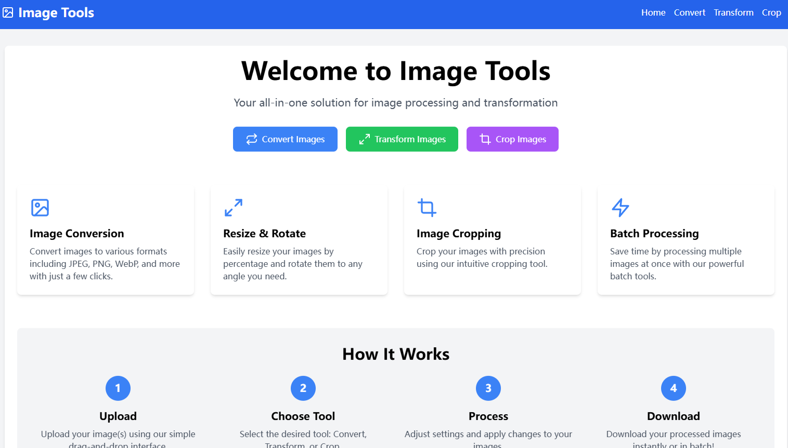

> A simplte image tools using react-image-crop



# Image Tools

Image Tools is a powerful and user-friendly web application that provides a suite of image processing capabilities. Built with React and TypeScript, it offers features like image conversion, transformation, and cropping, all within a sleek and intuitive interface.

## Features

- **Image Conversion**: Convert images between various formats (JPEG, PNG, WebP, etc.)
- **Image Transformation**: Resize and rotate images with ease
- **Image Cropping**: Precisely crop images using an interactive tool
- **Batch Processing**: Handle multiple images at once for efficient workflows

## Project Setup

### Prerequisites

- Node.js (v14 or later)
- npm (v6 or later)

### Installation

1. Clone the repository:
   ```
   git clone https://github.com/your-username/image-tools.git
   cd image-tools
   ```

2. Install dependencies:
   ```
   npm install
   ```

### Development

To run the development server:

```
npm run dev
```

This will start the Vite development server. Open your browser and navigate to `http://localhost:5173` to view the application.

### Building for Production

To create a production build:

```
npm run build
```

This will generate optimized files in the `dist` directory.

### Linting

To run the linter:

```
npm run lint
```

## Technologies Used

- React
- TypeScript
- Vite
- Tailwind CSS
- Framer Motion
- react-image-crop
- Lucide React (for icons)

## Contributing

Contributions are welcome! Please feel free to submit a Pull Request.

## License

This project is licensed under the MIT License.